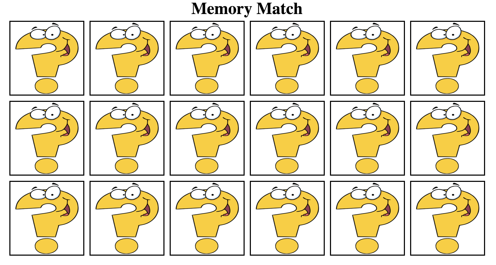

# Memory_game  
- Memory_game is a small demo game, created with HTML, CSS and JavaScript.

## Functionality
- Users can flip two cards each time and try to match the cards. 

## Screenshot

## Installation instructions:
- git clone https://github.com/mavisluan/memory_game.git
- double click the index.html file to open it in browser
